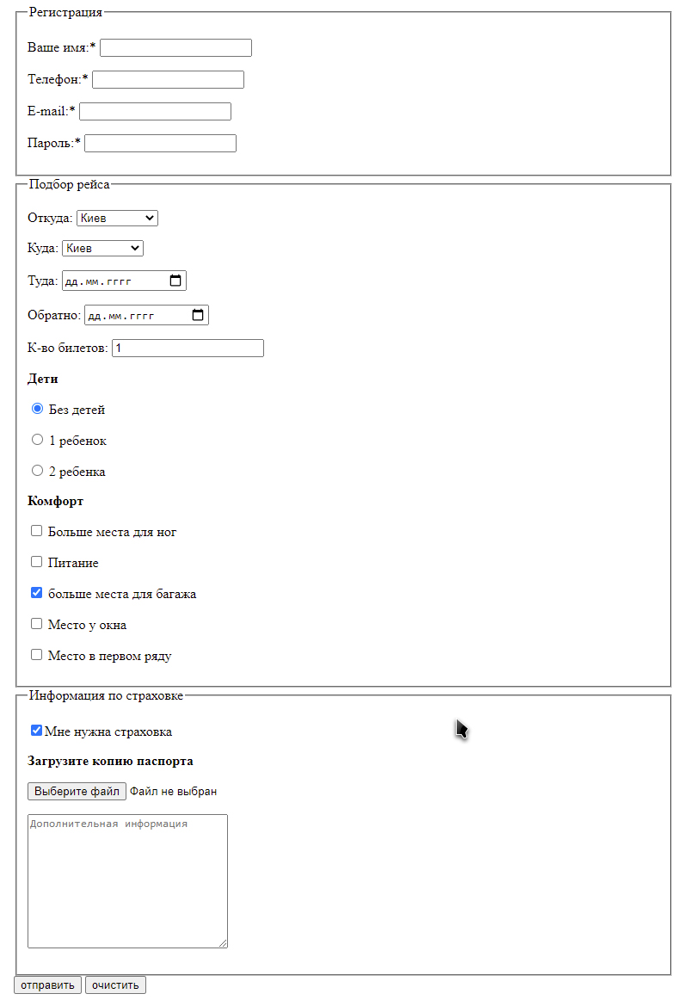
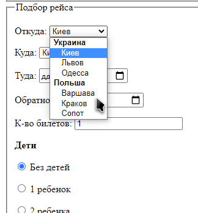

# Зробити розмітку форми на картинці.

# 1. Стилістика полів форми може відрізнятись у кожному браузері, на неї не звертаємо # увагу, важливо зробити правильну розмітку всіх елементів форми.

# 2. Форма має надсилати дані за цією адресою https://fom.in.ua/echo

# 3. При натисканні на кнопку відправлення ви побачите, які дані та в якому вигляді передаються

# 4. Форма не повинна відправлятися, якщо не заповнені поля позначені зірочкою *

# 5. Перше поле має бути у фокусі відразу після відкриття сторінки.

# 6. Кнопка «очистити» повинна скидати всю форму до стандартних налаштувань.

# 7. Тексти поряд з елементами форми повинні бути клікабельними та встановлювати фокус у полі поряд з яким знаходяться

